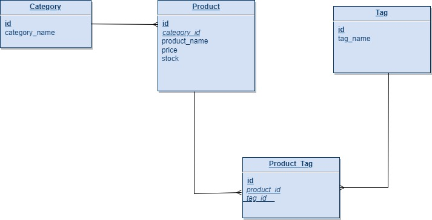

# E-Commerce Backend

## Description
This is a an e-commerce backend application for products with categories using express.js, json format API, sequelize to interact with MySQL database. 

## Database Design
> Relationship Diagram


Relationships: 
- One Category can have many Products
- One Product can have many Tags 
- One Tag can have many Products

## Installation 
This application used mySql server to store data. If you haven't got MySQL installed, here is a [MySQl installation guide](https://coding-boot-camp.github.io/full-stack/mysql/mysql-installation-guide)

> Clone the app
```
> git clone (clone_addess) 
```
> Initialise and installing necessary npm packages and dependencies
```
> npm install
```
> Fill the .env_template file and rename it to .env
```
DB_HOST=[hostname]
DB_PORT=[port]
DB_USER=[user]
DB_PWD=[password]
```
> Login MySQL
```
> mysql -u root -p
mysql> password: [enter your password]
```
> Build the application database: 
```
mysql> source db/schema.sql
```
> If you wish to seed the database
```
node seeds/index.js
```

## Usage
> To start the server, run the following command in the command line
```
> node server.js
```

## Testing
> The app can be tested on Insomnia

[Here is a short demo video of how to install and test the application](https://youtu.be/AOMMEk4pLDs)

